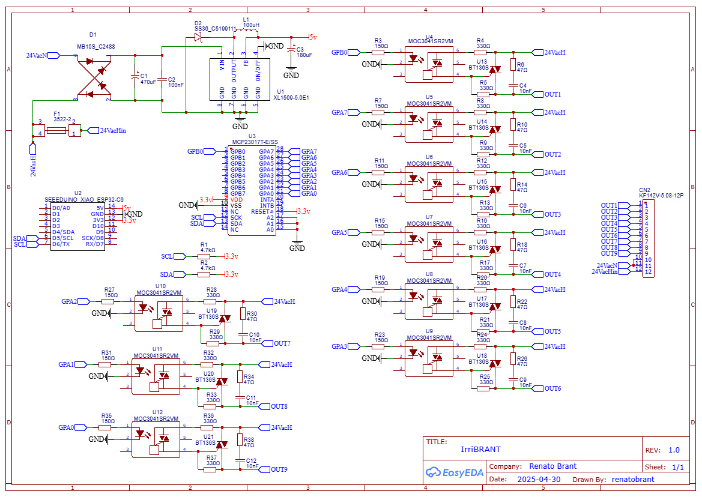

# irriBRANT - Advanced 9-Zone Smart Irrigation Controller

  

**irriBRANT** is a professional-grade smart irrigation controller designed to work natively with [Home Assistant](https://www.home-assistant.io/) and powered by [ESPHome](https://esphome.io/). 

The primary goal of this project is to integrate garden irrigation into a modern home automation ecosystem. By replacing traditional "dumb timers" with this intelligent, sensor-driven node, the system leverages real-time weather data, soil moisture levels, and complex logic to optimize water usage—making it far more efficient and sustainable.

---

## ⚠️ Current Project Status: PROTOTYPING PHASE (On Hold)

The project has reached a major milestone with the completion of the PCB layout. However, fabrication is currently paused due to supply chain constraints.

- [x] Full Schematic Design (v1.0)
- [x] Component Selection and Placement
- [x] **PCB Routing & Gerber Generation**
- [ ] **Prototype Fabrication (Paused):** Initial submission to JLCPCB was not accepted because certain components are currently out of stock in their assembly library. 
- [ ] **Next Steps:** Evaluating whether to swap specific components for better availability or switch to a different fabrication house.
- [ ] Firmware Development (ESPHome YAML)
- [ ] Field Testing & Validation

---

## Hardware Visuals

### 2D Layout (Top & Bottom)

  
  

### 3D Renderings

  
  
  

### Schematic
The detailed circuit design can be found in the image below or via the source files in the `hardware/` directory.

  

---

## Technical Overview & Component Selection

The irriBRANT was engineered with stability, safety, and signal integrity as priorities:

### 1. Logic & Connectivity: Seeed Studio Xiao ESP32-C6
The ESP32-C6 provides a modern connectivity suite, supporting **Wi-Fi 6, Zigbee, and Matter**. This ensures the controller is future-proof and maintains a reliable connection even in outdoor environments.

### 2. I/O Expansion: MCP23017
To manage 9 independent zones without exhausting the ESP32's native GPIOs, we utilize the MCP23017 I/O expander via I2C. This allows for clean, logical addressing of the valve drivers while keeping the ESP32 pins free for additional sensors.

### 3. Power Management: XL1509 Buck Converter
Since irrigation systems use **24VAC** transformers, we need a robust power stage:
- **Rectification:** A bridge rectifier converts 24VAC to ~34VDC.
- **Regulation:** The **XL1509-5.0** Step-Down Buck Converter handles the high voltage drop efficiently without the heat issues associated with linear regulators.

### 4. Actuation: Optoisolated Triacs
The irriBRANT uses solid-state switching for maximum durability:
- **MOC3041 Optocouplers:** Provide galvanic isolation between the DC logic and AC power, featuring **Zero-Crossing** detection to minimize electrical noise.
- **BT136S Triacs:** Robust AC switches designed to handle the inductive loads of 24VAC solenoid coils.

### 5. Protection & Signal Integrity
- **RC Snubbers:** Every channel includes a snubber ($47\Omega + 10nF$) to suppress voltage spikes when inductive loads are deactivated.
- **Fuse Protection:** A 5x20mm fuse holder on the 24VAC input protects the PCB and transformer from external shorts.

---

## Ecosystem Links
* **[Home Assistant](https://www.home-assistant.io/):** The open-source home automation platform that puts local control and privacy first.
* **[ESPHome](https://esphome.io/):** A system to control your microcontrollers by simple yet powerful configuration files.

---
*Developed as part of the Brant Channel project series.*
