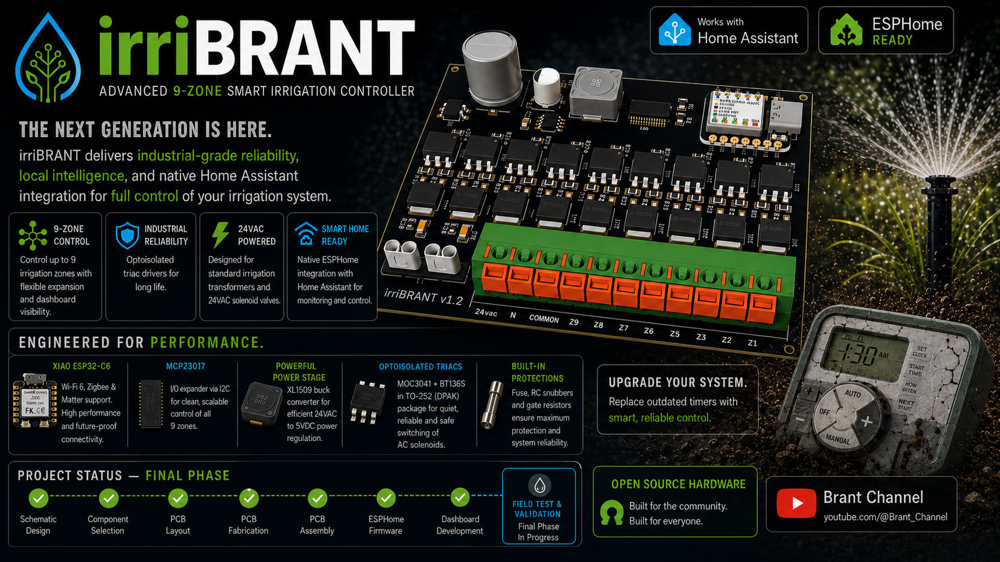

# irriBRANT - Advanced 9-Zone Smart Irrigation Controller

  

**irriBRANT** is a professional-grade smart irrigation controller designed to work natively with [Home Assistant](https://www.home-assistant.io/) and powered by [ESPHome](https://esphome.io/). 

The primary goal of this project is to integrate garden irrigation into a modern home automation ecosystem. By replacing traditional "dumb timers" with this intelligent, sensor-driven node, the system can leverage real-time weather data, soil moisture levels, and complex logic to optimize water usage—making it far more efficient and sustainable.

  
  

## ⚠️ Current Project Status: DESIGN PHASE
This project is currently in the active development stage.
- [x] Full Schematic Design (v1.0)
- [x] Component Selection and Placement
- [ ] PCB Routing (In Progress)
- [ ] Prototype Fabrication
- [ ] Firmware Development (ESPHome YAML)
- [ ] Field Testing & Validation

You can view the detailed schematic here: [Schematic v1.0 (PDF)](hardware/Schematic%20v1.0.pdf)

---

## Technical Overview & Component Selection

The irriBRANT was engineered with stability, safety, and signal integrity as priorities. Below are the technical justifications for the core components:

### 1. Logic & Connectivity: Xiao ESP32-C6
The ESP32-C6 provides a modern connectivity suite, supporting **Wi-Fi 6, Zigbee, and Matter**. This makes the controller future-proof and ensures a reliable connection even in outdoor environments.

### 2. I/O Expansion: MCP23017
To manage 9 independent zones without exhausting the ESP32's native GPIOs, we utilize the MCP23017 I/O expander via I2C. This allows for clean, logical addressing of the valve drivers while keeping the ESP32 pins free for additional sensors.

### 3. Power Management: XL1509 Buck Converter
Since irrigation systems use **24VAC** transformers, we need a robust power stage:
- **Rectification:** A bridge rectifier converts 24VAC to ~34VDC.
- **Regulation:** The **XL1509-5.0** Step-Down Buck Converter handles the high voltage drop efficiently without the heat issues of linear regulators.
- **Filtering:** High-quality power inductors and capacitors ensure the ESP32-C6 remains stable during Wi-Fi transmission peaks.

### 4. Actuation: Optoisolated Triacs
The irriBRANT uses Solid State switching for maximum durability:
- **MOC3041 Optocouplers:** Provide galvanic isolation between the DC logic and AC power. They feature **Zero-Crossing** detection to minimize electrical noise.
- **BT136S Triacs:** Robust AC switches designed to handle the inductive loads of 24VAC solenoid coils.

### 5. Protection & Signal Integrity
- **RC Snubbers:** Every channel includes a snubber ($47\Omega + 10nF$) to suppress voltage spikes when inductive loads are deactivated.
- **Fuse Protection:** A 5x20mm fuse holder on the 24VAC input protects the PCB and transformer from external shorts.
- **Gate Stability:** $330\Omega$ resistors between Gate and MT1 prevent accidental firing due to electrical noise.

---

## Ecosystem Links
* **[Home Assistant](https://www.home-assistant.io/):** The open-source home automation platform that puts local control and privacy first.
* **[ESPHome](https://esphome.io/):** A system to control your microcontrollers by simple yet powerful configuration files.

---
*Developed as part of the Brant Channel project series.*
