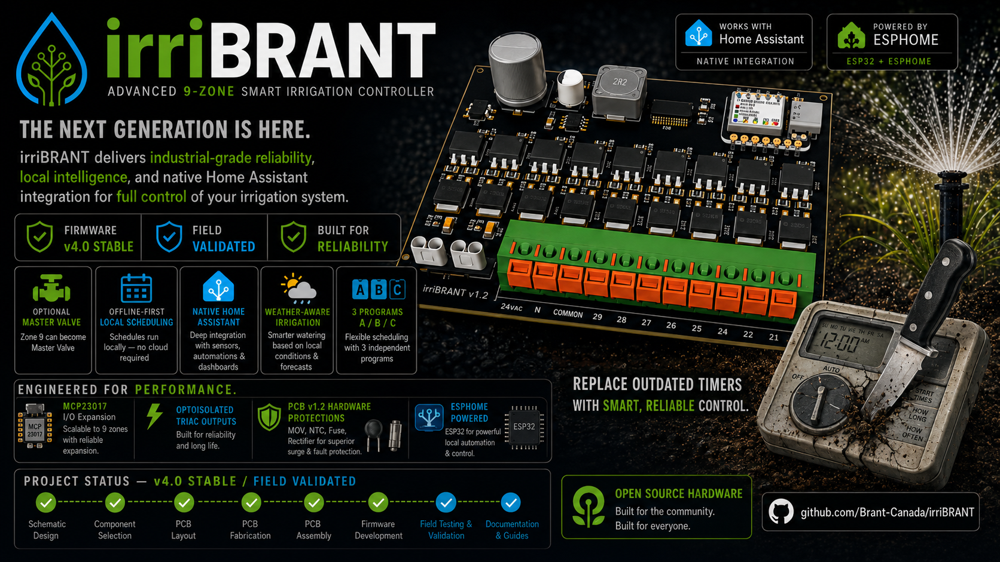

# irriBRANT - Advanced Smart Irrigation Controller

<p align="center">
  
</p>

<p align="center">
  <strong>Professional-grade ESPHome smart irrigation controller with local scheduling, offline-capable operation, Master Valve support, and native Home Assistant integration.</strong>
</p>

---

## Project Status

**Current stable firmware:** `v4.0-stable`  
**Current hardware revision:** `PCB v1.2`  
**Current stage:** **Field Validated / Active Reliability Testing**

irriBRANT has moved beyond prototype validation. The PCB has been designed, fabricated, assembled, flashed, integrated with Home Assistant, and validated with real irrigation valves.

The latest firmware release, **v4.0**, adds optional **Master Valve support using Zone 9** and has been successfully tested in the field.

---

## Overview

**irriBRANT** is a professional-grade smart irrigation controller designed to replace traditional irrigation timers with a modern, automation-first, locally controlled solution.

The controller is based on a **Seeed Studio XIAO ESP32-C6**, powered by **ESPHome**, and designed to integrate natively with **Home Assistant** while keeping the core irrigation logic inside the ESP32.

Unlike simple relay-based irrigation controllers, irriBRANT supports:

- Local irrigation scheduling
- Offline-capable operation
- Up to 9 irrigation outputs
- Optional Master Valve using Zone 9
- 3 independent irrigation programs
- Per-zone runtime configuration
- Cycle-and-soak style repeat cycles
- Per-program zone selection
- Persistent configuration stored on the ESP32
- Rain lock and manual rain delay
- Weather-aware irrigation blocking through Home Assistant sensors
- Next watering activity preview
- 5-day schedule preview
- Native Home Assistant dashboard integration
- OTA updates through ESPHome
- Hardware-level valve output indication
- Future flow and soil moisture expansion

The result is a flexible, reliable, and expandable irrigation platform for smart homes, DIY automation, and maker projects.

---

## Version Summary

| Version | Type | Status | Description |
|---|---|---|---|
| `v4.0-stable` | Firmware | Stable / Field Validated | Adds optional Master Valve support using Zone 9, updates firmware structure, and introduces dashboard support for Master Valve mode. |
| `v3.3-stable` | Firmware | Stable Rollback | Stable 9-zone irrigation firmware before Master Valve support. All 9 zones operate as standard irrigation zones. |
| `PCB v1.2` | Hardware | Field Test / Validation | Adds MOV surge protection, NTC inrush limiting, improved AC architecture, updated routing, and TO-252 triac output design. |
| `PCB v1.01` | Hardware | Functional Prototype | First assembled and tested board with ESP32-C6, MCP23017, 9 triac outputs, RGB LED, and zone LEDs. |

---

# v4.0 Stable - Master Valve Release

Firmware `v4.0` introduces the most important functional change so far: **optional Master Valve support**.

## Master Valve Behavior

When Master Valve mode is **disabled**:

- Zone 9 behaves as a normal irrigation zone.
- All 9 zones are available for manual control and programs.
- This preserves the legacy behavior from previous firmware versions.

When Master Valve mode is **enabled**:

- Zone 9 is reserved as the Master Valve output.
- Zone 9 is blocked from normal irrigation operation.
- Programs A/B/C automatically skip Zone 9.
- Manual Zone 9 irrigation requests are ignored.
- The Master Valve opens before Zones 1-8.
- The Master Valve closes only after all active Zones 1-8 are off.
- Multi-zone operation keeps the Master Valve open until the last active zone closes.

## Master Valve Configuration

The firmware exposes:

| Control | Purpose |
|---|---|
| `Use Master Valve` | Enables or disables Master Valve mode. |
| `Master Valve Delay` | Defines the delay between opening the Master Valve and opening the irrigation zone. |

Default behavior:

```text
Use Master Valve: OFF
Master Valve Delay: 2 seconds
```

## Master Valve Field Validation

The following tests were completed successfully:

- Master Valve OFF: Zone 9 works as a normal irrigation zone.
- Master Valve ON: Zone 9 is blocked as a normal zone.
- Zone 1 starts: Master Valve opens first, then Zone 1 opens after the delay.
- Zone 1 stops: Zone 1 closes, then Master Valve closes.
- Zone 1 + Zone 2 active: closing Zone 1 keeps Master Valve open.
- Last zone closes: Master Valve closes.
- Programs skip Zone 9 when Master Valve mode is enabled.
- OTA update completed successfully.
- MCP23017 I2C expander detected correctly at address `0x20`.

---

# v3.3 Stable - Pre-Master Valve Release

Firmware `v3.3-stable` remains available as a stable rollback point.

This version includes:

- 9 standard irrigation zones
- Manual zone control
- Program A/B/C support
- Schedule configuration
- Per-zone durations
- Per-program zone selection
- Cycle count and transition delay logic
- Rain lock support
- Home Assistant dashboard integration
- Next activity preview
- ESPHome OTA update support

Important limitation:

> `v3.3-stable` does **not** include Master Valve support. In v3.3, Zone 9 always behaves as a normal irrigation zone.

---

# Hardware v1.2

Hardware revision `PCB v1.2` improves the electrical robustness of the board and moves the project closer to a production-ready design.

## Main Hardware Features

- Seeed Studio XIAO ESP32-C6 main controller
- MCP23017 I2C I/O expander
- 9 optoisolated 24VAC triac outputs
- MOC optotriac drivers
- BT136S triacs in TO-252 / DPAK package
- RGB status LED
- 9 individual yellow zone indicator LEDs
- Local tactile push button
- 24VAC irrigation transformer input
- Fuse protection
- MOV surge protection
- NTC inrush current limiter
- RC snubber network per output
- Home Assistant / ESPHome native integration

## AC Input Protection Chain

The v1.2 AC input architecture is:

```text
24VAC Input
→ MOV Surge Protection
→ NTC 10D-11 Inrush Current Limiter
→ Fuse
→ Bridge Rectifier
→ Filtering Stage
→ Buck Converter
→ 5V Rail
→ ESP32 3.3V Regulation
```

This improves protection against surge events, startup inrush, and electrical stress from field wiring.

## Output Switching

Each valve output uses an optoisolated triac switching stage for 24VAC irrigation solenoids.

Main output components:

| Component | Purpose |
|---|---|
| MOC optotriac | Logic-to-AC isolation and triac triggering |
| BT136S triac | Solid-state AC switching |
| RC snubber | Transient suppression for inductive loads |
| Yellow LED | Local output activity indication |

The active hardware design uses **TO-252 / DPAK triac packaging**.

---

# Firmware Architecture

irriBRANT is developed as an **ESPHome standalone irrigation controller**.

Home Assistant is used for dashboard, monitoring, configuration, remote control, weather data, and OTA updates. The ESP32 remains responsible for irrigation execution and local schedule logic.

## ESP32 Responsibilities

The ESP32 handles:

- Zone execution
- Program execution
- Irrigation scheduling
- Runtime logic
- Repeat cycle logic
- Zone enable/disable state
- Master Valve sequencing
- Rain lock state
- Manual start/stop actions
- Persistent configuration
- Safety lockouts
- Local operation when Home Assistant is unavailable

## Home Assistant Responsibilities

Home Assistant provides:

- Dashboard interface
- Configuration UI
- Manual control
- Weather data source
- Diagnostics display
- Irrigation history
- OTA firmware updates
- Optional automations around the irrigation controller

This architecture allows irriBRANT to continue operating even if Home Assistant is offline, unavailable, or rebooting.

---

# Current Firmware Structure

The active firmware path was restructured in v4.0.

## Current Active Path

```text
firmware/irribrant.yaml
firmware/packages/
firmware/COMPILE.bat
```

## Package Layout

```text
firmware/
  irribrant.yaml
  COMPILE.bat
  packages/
    hardware.yaml
    irrigation.yaml
    programs.yaml
    program_settings.yaml
    scheduler.yaml
    weather.yaml
    diagnostics.yaml
    next_activities.yaml
```

## Package Responsibilities

| Package | Responsibility |
|---|---|
| `hardware.yaml` | ESP32, I2C, MCP23017, GPIO outputs, RGB LED, button, hardware definitions |
| `irrigation.yaml` | Zone outputs, sprinkler controller, Master Valve logic, stop-all logic |
| `programs.yaml` | Program A/B/C execution logic |
| `program_settings.yaml` | Program schedules, days, durations, repeats, and zone selections |
| `scheduler.yaml` | Time-based execution and scheduler tick logic |
| `weather.yaml` | Rain lock, rain delay, and weather sensor inputs |
| `diagnostics.yaml` | Wi-Fi, uptime, firmware version, status sensors |
| `next_activities.yaml` | Next activities and 5-day schedule text sensors |

Older `firmware/v3.0/` paths are no longer the active firmware path.

---

# Irrigation Program System

irriBRANT supports **3 independent irrigation programs**:

```text
Program A
Program B
Program C
```

Each program supports:

| Feature | Description |
|---|---|
| Enable / Disable | Turns each program schedule on or off independently |
| Frequency | Selected weekdays, daily, every 2 days, or every 3 days |
| Start Time | Configurable hour and minute |
| Days of Week | Sunday through Saturday selection |
| Included Zones | Each zone can be included or excluded per program |
| Runtime per Zone | Individual duration per zone per program |
| Cycle Count | Repeats a program up to 5 times |
| Transition Delay | Delay between zones and repeated cycles |
| Rain Lock Awareness | Programs are skipped when rain lock is active |
| Master Valve Awareness | Zone 9 is skipped when Master Valve mode is enabled |

This supports irrigation strategies such as:

- Deep watering
- Cycle-and-soak
- Morning irrigation
- Separate lawn and garden programs
- Seasonal runtime adjustments
- Different schedules for different areas

---

# Zone System

irriBRANT supports up to **9 physical 24VAC outputs**.

## Standard Zone Mode

When Master Valve mode is disabled:

- Zones 1-9 are available as normal irrigation zones.
- Zone 9 behaves exactly like the other zones.

## Master Valve Mode

When Master Valve mode is enabled:

- Zones 1-8 remain irrigation zones.
- Zone 9 becomes the Master Valve output.
- Zone 9 is removed from normal program operation.
- Zone 9 cannot be enabled as a normal zone.

## Zone Features

Each irrigation zone supports:

- Manual open/close
- Program inclusion/exclusion
- Runtime configuration
- Active/inactive configuration
- Individual status feedback
- Individual PCB indicator LED
- Home Assistant entity exposure

---

# Home Assistant Dashboard

The Home Assistant dashboard is the main interface for configuration, monitoring, and manual operation.

## Dashboard v4.0 Updates

The v4.0 dashboard adds Master Valve support.

New dashboard behavior:

- `Master Yes / Master No` badge shows whether Master Valve mode is enabled.
- The badge does not imply that the valve is physically open.
- Master Valve settings were added inside Zone Settings.
- Master Valve status shows open/closed based on active irrigation zones.
- When Master Valve mode is ON, Zone 9 is shown as reserved for Master Valve.
- When Master Valve mode is OFF, Zone 9 appears as a normal irrigation zone.
- Program A/B/C panels hide Zone 9 settings when Master Valve mode is ON.

## Dashboard Sections

| Section | Purpose |
|---|---|
| Upcoming Watering | Shows next scheduled irrigation activity |
| Main Controls | Main system, active cycle, auto advance |
| Run Program | Manual Program A/B/C start buttons |
| Active Zones | Manual control for active zones and Master Valve indicator |
| Zone Settings | Zone enable/disable and Master Valve configuration |
| Rain Settings | Rain lock and rain delay configuration |
| Status | Wi-Fi, uptime, firmware version, schedule, rain lock |
| Program A/B/C | Schedule, frequency, runtime, repeats, days, and zones |
| Watering Activity | 24-hour irrigation history graph |
| Rain History & Forecast | Rain intensity and probability chart |

<p align="center">
  
  
</p>

---

# Weather-Aware Irrigation

irriBRANT supports weather-aware irrigation blocking through Home Assistant sensors.

## Current Weather Features

- Rain lock status
- Rain delay hours
- Clear rain delay button
- Rain probability threshold
- Rain intensity block threshold
- Current rain intensity input
- Rain probability input
- Rain source selector

## Weather Inputs

The controller can consume Home Assistant weather sensors for:

- Current rain intensity
- Forecast rain probability
- Rain delay logic
- Future weather-aware improvements

## Weather Roadmap

Planned improvements include:

- Forecast-based skip refinement
- Snow forecast lockout
- Seasonal adjustment
- Evapotranspiration-based runtime adjustment
- Smart Irrigation integration options

---

# Diagnostics and Status

irriBRANT exposes diagnostic information through ESPHome and Home Assistant.

Current diagnostics include:

- Wi-Fi status
- Wi-Fi signal percentage
- Uptime
- Firmware version
- System has schedule
- Rain lock
- Active cycle
- Main irrigation system state
- Zone activity
- Master Valve mode
- Master Valve delay
- Next activities
- 5-day schedule

## RGB Status LED

A dedicated RGB status LED provides visual feedback.

Current status behavior includes:

| LED Behavior | Meaning |
|---|---|
| Boot animation | Device startup |
| Red blink | No Wi-Fi |
| Green pulse | Connected and idle |
| Blue blinks | Active zone number indication |
| Yellow | Rain lock active |
| Red/Green alternating | Connected but no active schedule |

## Individual Zone LEDs

Each output includes a yellow LED for local indication.

This helps during:

- Installation
- Field testing
- Valve troubleshooting
- Manual output verification
- Firmware validation

---

# Hardware Visuals

## Real Board Photos

<p align="center">
  
  
  
  
  
  
  
</p>

---

## PCB Layout

<p align="center">
  
  
</p>

---

## 3D PCB Renderings

<p align="center">
  
  
  
</p>

---

# Schematic

The complete schematic is available below.

<p align="center">
  
</p>

---

# Technical Overview

## Main Controller: Seeed Studio XIAO ESP32-C6

The controller is based on the **Seeed Studio XIAO ESP32-C6**.

The ESP32-C6 provides:

- Wi-Fi
- Bluetooth LE
- Modern ESP-IDF support
- ESPHome compatibility
- Compact footprint
- Low power consumption
- Future smart-home protocol exploration options

---

## I/O Expansion: MCP23017

The **MCP23017 I2C I/O expander** manages the irrigation output control lines while preserving ESP32 GPIOs for other functions.

Current configuration:

```text
I2C address: 0x20
SDA: GPIO23
SCL: GPIO16
Frequency: 50 kHz
```

Benefits:

- Clean GPIO expansion
- Simplified PCB routing
- Easy support for 9 outputs
- Better firmware organization
- Room for future expansion

---

## Valve Switching: Optoisolated Triac Outputs

Each irrigation valve is controlled through an optoisolated AC switching stage.

### Optotriac Stage

The optotriac stage provides:

- Galvanic isolation
- Logic-to-AC separation
- Reduced noise coupling
- Safer switching of 24VAC valve loads

### BT136S Triac Output Stage

The output stage uses BT136S class surface-mount triacs.

Benefits:

- Solid-state switching
- Silent operation
- No relay contacts
- No mechanical wear
- Compact PCB footprint
- Suitable for 24VAC irrigation solenoids

Depending on sourcing and design revision, the board may use BT136S-600D or BT136S-800D class devices.

---

## Protection and Signal Integrity

### MOV Surge Protection

A MOV is installed on the 24VAC input to help absorb voltage spikes from field wiring or transformer-side transients.

### NTC Inrush Current Limiter

An NTC `10D-11` limits startup inrush current into the downstream rectifier and filtering stage.

### Fuse Protection

A replaceable blade fuse protects the 24VAC side from excessive current events.

The fuse helps protect:

- PCB traces
- Valve power path
- Irrigation transformer
- Output switching stage

### RC Snubber Network

Each output includes an RC snubber network to suppress transients from inductive irrigation valve loads.

Typical network:

```text
47Ω resistor
10nF capacitor
```

---

# Home Assistant Integration

irriBRANT integrates with Home Assistant through ESPHome.

Supported features:

- Native ESPHome integration
- Individual valve entities
- Manual zone control
- Program start buttons
- Program configuration entities
- Master Valve configuration
- System diagnostics
- OTA firmware updates
- Wi-Fi status monitoring
- Signal strength monitoring
- Uptime monitoring
- Rain lock status
- Irrigation history
- Weather-based blocking
- Dashboard customization

Home Assistant is the interface, not the core irrigation brain.

---

# Testing Notes

The project has validated:

- ESPHome firmware flashing
- OTA update flow
- ESP32-C6 boot
- MCP23017 I2C communication at `0x20`
- Correct output addressing
- 9-zone manual output control
- 24VAC switching under real solenoid loads
- Home Assistant entity creation
- Dashboard control
- Program A/B/C structure
- Rain lock logic
- Next activity text sensor
- 5-day schedule text sensor
- Master Valve mode OFF behavior
- Master Valve mode ON behavior
- Multi-zone Master Valve hold-open behavior

Ongoing validation includes:

- Long-term outdoor reliability
- Enclosure thermal behavior
- Extended seasonal testing
- Weather forecast refinement
- Final documentation package

---

# Hardware Summary

| Subsystem | Component / Feature |
|---|---|
| Main Controller | Seeed Studio XIAO ESP32-C6 |
| I/O Expansion | MCP23017 |
| I2C Address | `0x20` |
| Outputs | 9 AC valve outputs |
| Switching | MOC optotriacs + BT136S triacs |
| Triac Package | TO-252 / DPAK |
| Input Power | 24VAC irrigation transformer |
| Protection | MOV, NTC 10D-11, blade fuse |
| Noise Suppression | RC snubber per output |
| Logic Power | Rectified and regulated DC rail |
| Status | RGB status LED |
| Zone Feedback | 9 individual yellow zone LEDs |
| Local Control | Tactile push button |
| Firmware | ESPHome |
| Integration | Home Assistant native ESPHome API |
| Master Valve | Optional, using Zone 9 output |

---

# Roadmap

## Completed

- PCB design
- PCB fabrication
- PCB assembly
- ESPHome firmware architecture
- MCP23017 output expansion
- 9-zone output validation
- Home Assistant integration
- Program A/B/C structure
- Offline-capable controller architecture
- Rain lock logic
- Next activity and 5-day schedule sensors
- Master Valve support using Zone 9
- Dashboard v4.0 Master Valve support
- OTA field update
- Real valve testing

## In Progress

- Long-term field testing
- Dashboard usability refinement
- Documentation cleanup
- Weather forecast tuning
- Installation documentation
- Enclosure planning

## Planned

- Flow sensor support
- Leak detection
- Soil moisture sensor support
- Seasonal adjustment
- ET-based watering adjustment
- Snow forecast lockout
- Outdoor enclosure version
- DIN rail enclosure version
- Expansion module support
- Local web interface improvements
- Troubleshooting guide
- YouTube build and demo series

---

# Ecosystem Links

- [Home Assistant](https://www.home-assistant.io/)
- [ESPHome](https://esphome.io/)
- [Seeed Studio XIAO ESP32-C6](https://www.seeedstudio.com/Seeed-XIAO-ESP32C6-p-5884.html)

---

# Safety Notice

irriBRANT is an open-source DIY electronics project.

Although the irrigation side is based on low-voltage 24VAC systems, users should still take proper precautions when working with transformers, outdoor wiring, water, and electrical enclosures.

Use proper fusing, waterproof enclosures, strain relief, and installation practices according to local electrical requirements.

---

# License

This project is open-source and intended for educational, maker, and home automation applications.

---

<p align="center">
  Developed as part of the Brant Channel project series.
</p>
